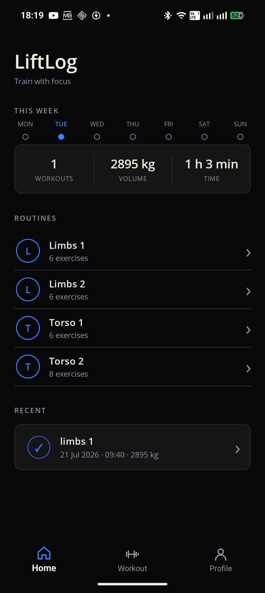
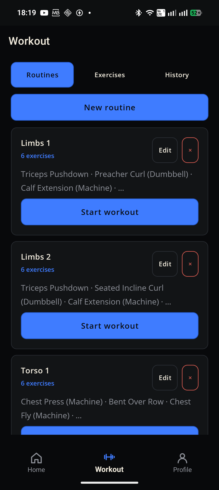
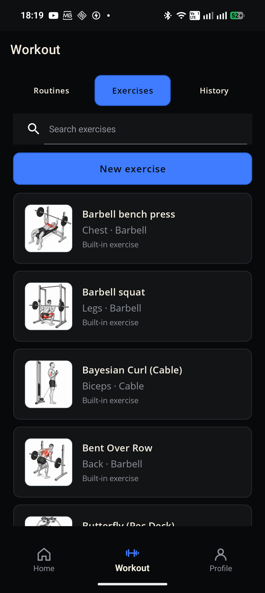
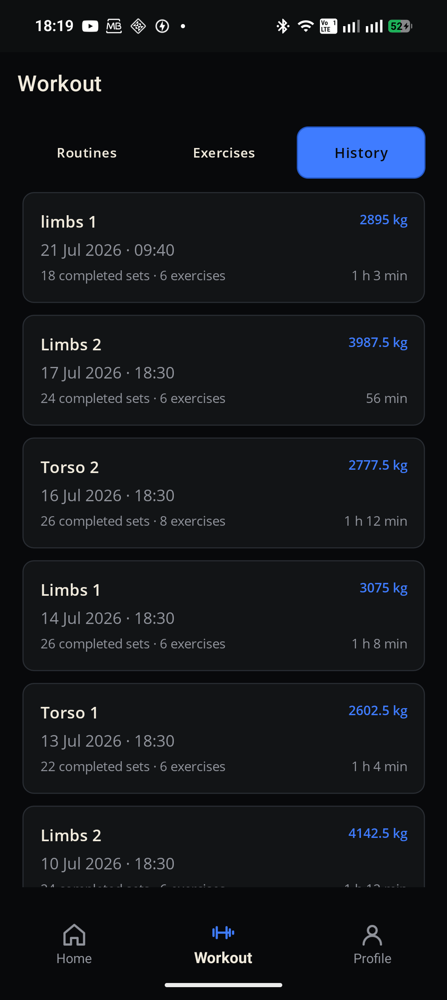
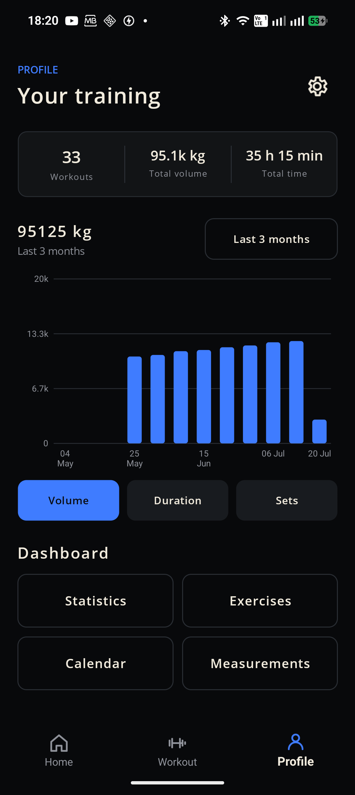
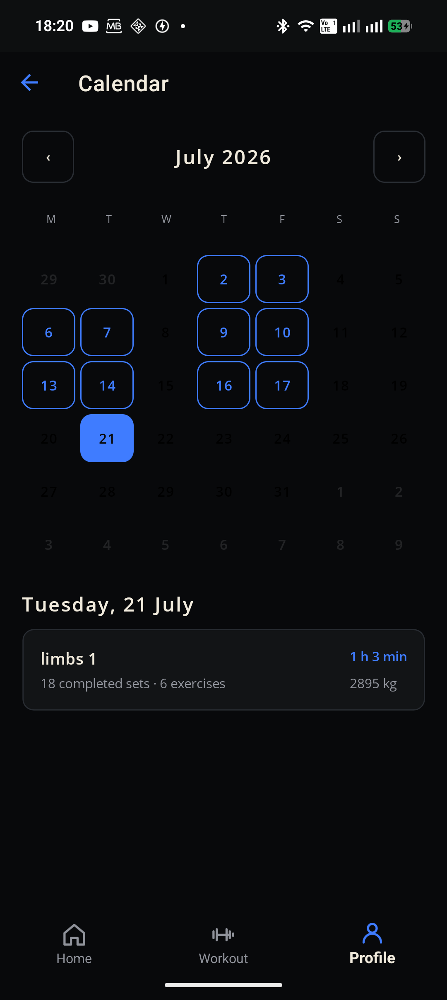

# LiftLog

LiftLog is an offline-first Android workout tracker built with C#, .NET MAUI,
and SQLite. It keeps workout data on the device and is designed to remain
useful without an account, backend, or internet connection.

## App Preview

<p align="center">
  
  
  
</p>

<p align="center">
  
  
  
</p>

## Features

- Create custom exercises and reusable workout routines.
- Record weight, repetitions, RPE, warm-up sets, and other set types.
- Recover an in-progress workout automatically after the app closes.
- Compare each exercise with its previous performance.
- Review workout history, training volume, and personal records.
- Track body measurements and progress over configurable periods.
- Browse an offline exercise catalogue with bundled illustrations.
- Export and import local workout data.

## Technology

- .NET 10 and .NET MAUI
- C# and XAML
- MVVM with CommunityToolkit.Mvvm
- Entity Framework Core with SQLite
- xUnit integration tests using in-memory SQLite databases

## Architecture

The solution separates the mobile interface from its domain and persistence
logic:

```text
LiftLog/
|-- src/
|   |-- LiftLog.App/      # MAUI UI, navigation, and device integrations
|   `-- LiftLog.Core/     # Domain models, services, and SQLite persistence
|-- tests/
|   `-- LiftLog.Tests/    # Service and database integration tests
|-- LiftLog.sln
`-- global.json
```

`LiftLog.Core` has no dependency on MAUI, allowing its workout rules,
statistics, validation, and database behavior to be tested independently.
Short-lived Entity Framework contexts are created through
`IDbContextFactory`, while workout changes are persisted immediately to make
active-session recovery reliable.

## Requirements

- .NET SDK 10.0.301 or a compatible .NET 10 SDK
- .NET MAUI workload
- Android SDK
- JDK 21
- Android device with USB debugging enabled, or an Android emulator

## Build

Restore dependencies and build the Android application from the repository
root:

```powershell
dotnet workload restore
dotnet restore .\LiftLog.sln
dotnet build .\src\LiftLog.App\LiftLog.App.csproj -f net10.0-android
```

Depending on the local Android setup, `JAVA_HOME` and `ANDROID_HOME` may need
to be configured before building.

## Tests

Run the automated test suite with:

```powershell
dotnet test .\tests\LiftLog.Tests\LiftLog.Tests.csproj
```

The test suite covers exercise and routine management, active workout
persistence, workout history, statistics, body measurements, and database
initialization and upgrade behavior.

## Privacy

LiftLog stores workout and measurement data locally. The application does not
require a user account or a remote service to track workouts.

## Project Status

LiftLog is a functional portfolio project validated on a physical Android
device. Development continues through usability improvements, broader device
testing, and additional automated coverage.
